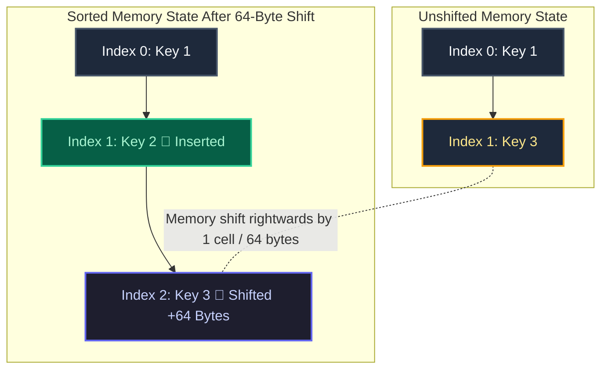

## Why Sorted Insertion is Critical for B+Trees

In our previous stage, incoming cells were appended directly to the end of the leaf page in the chronological order of arrival. While fast for initial writing, unsorted pages degrade table searches into linear O(N) scans. Furthermore, when an overflowing B+Tree leaf node must split in two during Stage 8, calculating a clean median dividing line is impossible unless cells are maintained in strictly sorted numerical order!

When inserting an out-of-order key (for example, inserting **Key 2** into a page currently holding **Key 1** and **Key 3**), our engine utilizes binary search to locate Index #1 as the insertion target. It then safely shifts all cells from Index #1 onward to Index #2, opening a pristine, gapless 64-byte insertion slot:

```
BEFORE INSERTING KEY 2 (Unshifted Page Memory):
┌──────────┬───────────┬───────────┬────────────────────────────────────┐
│  HEADER  │ CELL #0:  │ CELL #1:  │ (Unoccupied free memory space)     │
│ cells=2  │ Key = 1   │ Key = 3   │                                    │
└──────────┴───────────┴───────────┴────────────────────────────────────┘
                              │
                              ▼  (Memory shift rightwards by 1 cell / 64 bytes)
AFTER MEMORY SHIFT & INSERTION (Sorted Page Memory):
┌──────────┬───────────┬───────────┬───────────┬────────────────────────┐
│  HEADER  │ CELL #0:  │ CELL #1:  │ CELL #2:  │ (Remaining free space) │
│ cells=3  │ Key = 1   │ Key = 2   │ Key = 3   │                        │
└──────────┴───────────┴───────────┴───────────┴────────────────────────┘
```

#### Declarative Mermaid Memory Shift View


## The Table Cursor Abstraction

To cleanly divorce high-level query planning from low-level page math, relational database engines utilize an abstraction called a **Table Cursor**. Rather than letting the SELECT execution loop directly tamper with raw Buffer Pool pointers, a Cursor acts as a logical navigator pointing to a distinct record position:

1. **Start of Table**: Positioned at Page #0, Cell #0.
2. **Cursor Advance**: Moves forward by incrementing the cell index. In future stages, when a cursor reaches the final cell of a leaf page, it automatically follows the node's sibling pointer to transition smoothly onto the next sequential leaf!
3. **End of Table Detection**: Reaches completion when the cursor attempts to read a cell index matching the total number of valid records in the active table or node.

Using cursors guarantees that your `SELECT * FROM users;` implementation remains perfectly stable and decoupled from internal memory layouts, even as your B+Tree begins expanding across hundreds of interconnected memory pages!
