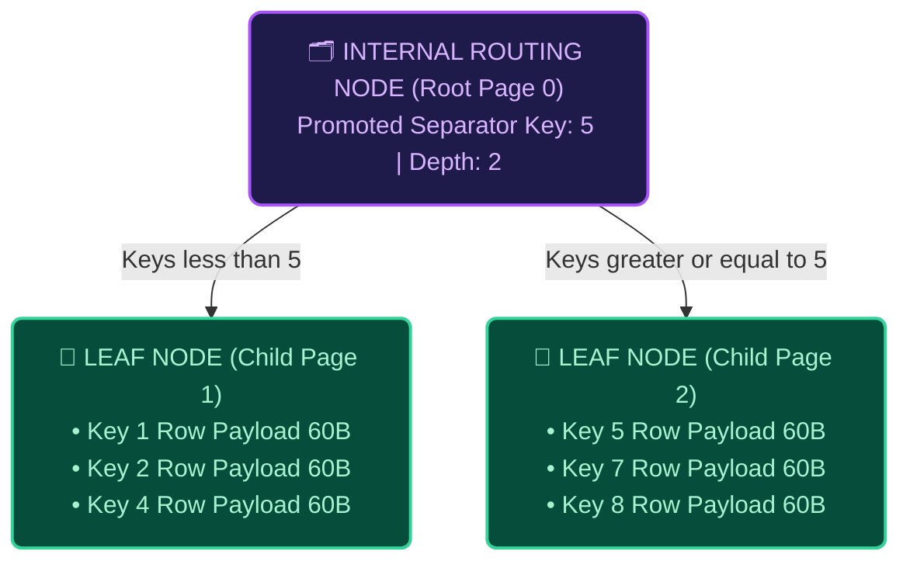

## The B+Tree Split: Retaining Payloads in Leaves

One of the most profound behavioral differences between a standard B-Tree and our high-performance **B+Tree** is manifested during node splitting. 

In a conventional B-Tree, when a node overflows and fractures in half, the median table record is physically stripped from the leaf and pushed up into the parent internal node. While mathematically sound for simple in-memory binary trees, scattering complex user records across upper index branches ruins relational storage performance, destroying the ability to run rapid sequential range scans!

In our **B+Tree storage engine**, table tuples are sacred citizens of the bottom leaf tier:

```
OVERFLOWING SINGLE LEAF NODE (Page #0 reaching capacity limit):
┌─────────────────────────────────────────────────────────────────────────┐
│ [Key:1 | Payload] [Key:2 | Payload] ... [Key:7 | Payload] [Key:8 Incoming]│
└─────────────────────────────────────────────────────────────────────────┘
                                   │
                                   ▼  (B+Tree Split: Promote routing COPY only!)
NEW TREE HIERARCHY (Depth: 2):
                       ┌─────────────────────────────┐
                       │ INTERNAL ROOT (Page #0):    │
                       │ [ Child Ptr: Page 1 ]       │
                       │ [ Separator Key: 5  ]       │
                       │ [ Rightmost Ptr: Page 2 ]   │
                       └──────────────┬──────────────┘
              ┌───────────────────────┴───────────────────────┐
              ▼ (Keys < 5)                                    ▼ (Keys >= 5)
┌─────────────────────────────┐                 ┌─────────────────────────────┐
│ LEAF NODE (Left Child #1):  │                 │ LEAF NODE (Right Child #2): │
│ [Key:1|Data] [Key:2|Data]   │                 │ [Key:5|Data] [Key:6|Data]   │
│ [Key:3|Data] [Key:4|Data]   │                 │ [Key:7|Data] [Key:8|Data]   │
└─────────────────────────────┘                 └─────────────────────────────┘
```

#### Declarative Mermaid Tree Hierarchy


Notice how **Key 5** appears twice in our new architecture:
1. It resides inside **Right Child Page 2** as a genuine table cell holding the authentic user row payload for user #5.
2. A compact **copy** of Key 5 (just the 4-byte integer, stripped of its 60-byte text payload) is promoted upward into the newly born **Internal Root Node** to act as a lightweight traffic director!

## Anatomy of an Internal Routing Node

When Root Page 0 transitions from an overflowing leaf into an **Internal Node**, its memory layout shifts dramatically. It ceases to hold user text records and instead dedicates its 4KB buffer exclusively to routing components:

* **Node Type Flag**: Marked as `INTERNAL` (0x02) to notify query cursors to branch downward rather than evaluating text payloads.
* **Number of Keys Counter**: Tracks how many dividing separator keys currently populate the routing table.
* **Rightmost Child Pointer**: An integer specifying the Buffer Pool Page ID of the rightmost child branch (used whenever a search query requests a key greater than all separator values).
* **Routing Cell Array**: A hyper-dense sequence of paired integer attributes: `[ Child Page Pointer (4 bytes) | Separator Key (4 bytes) ]`. Because each routing entry consumes merely 8 bytes, a single internal page can direct query traffic across hundreds of distinct child branches!

## Sequential Allocation & Sibling Linking

During a leaf node split, allocating the **Left Child** first and the **Right Child** second is highly recommended to maintain strict physical sequential order in the database file (e.g., Page 1 followed immediately by Page 2 on disk). When the OS reads the file sequentially, preserving this physical ordering triggers hardware-level **Read-Ahead Caching**, vastly accelerating `SELECT *` scans!

Equally important is the `next_leaf` pointer (Offset 6 in our leaf headers). When a node fractures in two, the original Left leaf must securely chain its `next_leaf` pointer to the newly minted Right leaf. This invisible linked list spans across the bottom of the B+Tree, allowing full table scans to hop horizontally from leaf to leaf without continually traversing down from the root!

## Multi-Split Scalability

When users invoke massive data ingestion pipelines (such as our integration tests inserting 30 or more sequential user tuples), your B+Tree dynamically repeats the median split protocol. As child leaves continue overflowing, they send additional separator keys upward into their parent internal nodes. 

Through this elegant, self-balancing mechanics, your B+Tree storage engine maintains uniform tree depth across all branches, guaranteeing logarithmic lookups and reliable sequential table scans no matter how millions of relational records are inserted!
