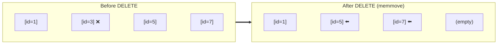

## Completing the CRUD Cycle

So far, our database supports **C**reate (INSERT) and **R**ead (SELECT). In this stage, we will implement the final pieces of the puzzle: **U**pdate and **D**elete.

Because we are doing this *before* introducing variable-length strings and slotted pages (which happen in Part 2), our implementation will be surprisingly simple! Since every row in our database currently takes exactly 508 bytes, and each cell (key + row) takes exactly 512 bytes, we can manipulate them like a standard array in memory.

## DELETE: Shifting Cells

When a user executes `DELETE FROM users WHERE id = 3`, the engine performs the following steps:

1. **Find**: Use our existing `btree_find(3)` function to locate the exact leaf page and cell index.
2. **Shift**: Remove the cell by sliding all subsequent cells to the left.
3. **Decrement**: Update the `num_cells` counter in the leaf page header.

In C, this left-shift is accomplished efficiently using `memmove`, which safely copies overlapping memory regions.

> [!NOTE]
> **What about B-Tree Underflow?** 
> In a complete B-Tree implementation, if a node's occupancy drops below 50% after a deletion, it should be merged with a sibling node (Underflow). However, in many real-world databases (like PostgreSQL), nodes are rarely merged immediately because doing so is computationally expensive and locks large portions of the tree. Instead, they rely on background processes (like `VACUUM`) to reclaim space later. To keep things simple, we will skip node merging for now.

## UPDATE: In-Place Mutation

When a user executes `UPDATE users SET name = 'bob' WHERE id = 3`, the process is even simpler. Because our rows are fixed-size, the new data is guaranteed to fit in the exact same slot as the old data.

1. **Find**: Locate the cell using `btree_find(3)`.
2. **Deserialize**: Read the existing row data into memory.
3. **Modify**: Change the `name` field.
4. **Serialize**: Write the modified row back to the exact same byte offset in the leaf page.

By executing this in-place, the B-Tree structure is completely unaffected. No cells need to shift, and no nodes need to split!

## The Volcano Integration

Remember the Volcano Model we implemented in Stage 11? `DELETE` and `UPDATE` fit perfectly into this architecture. The Query Planner simply generates a `DeleteNode` or `UpdateNode` instead of an `IndexScan` or `SeqScan`. 

When the executor loop runs `plan->next()`, these modification nodes will locate the target row, perform the mutation, and return the modified row (or a success indicator) to the user.
