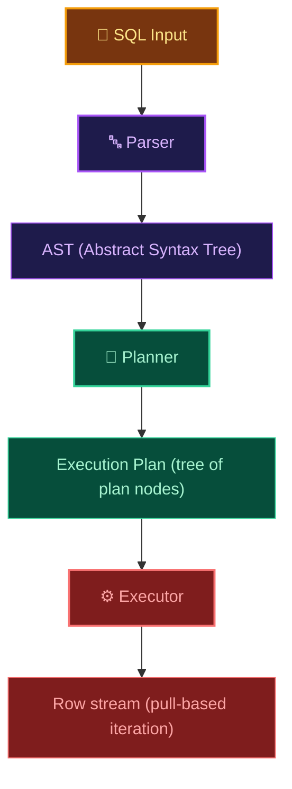
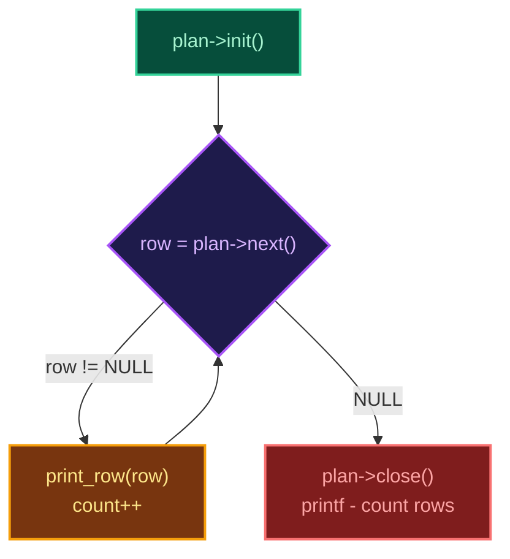
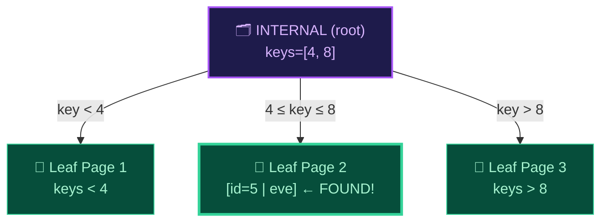
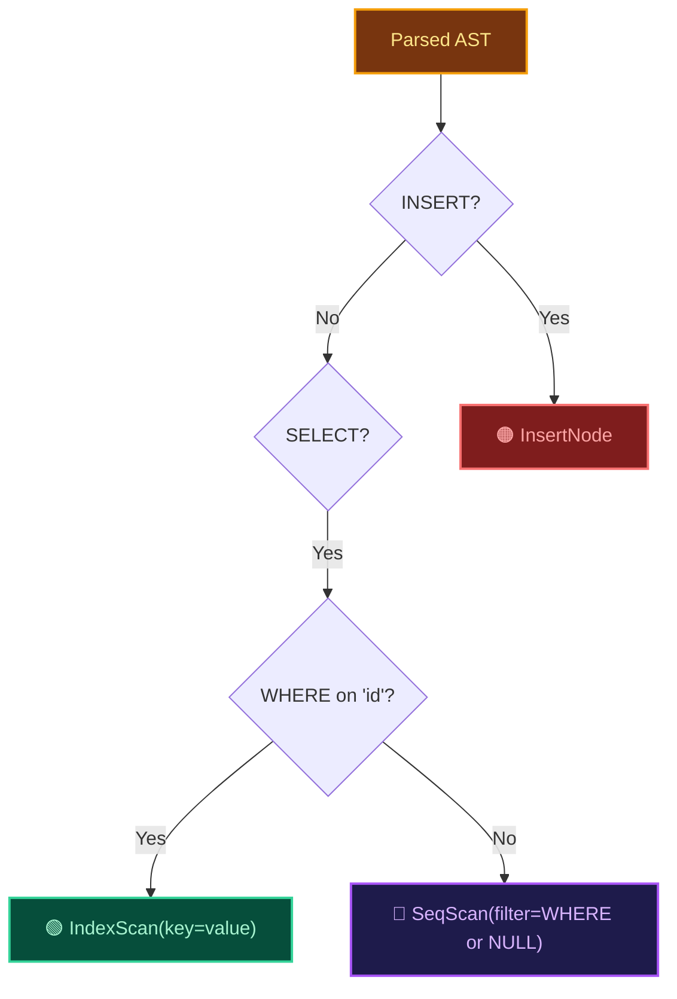

## The Monolith Problem

Before this stage, our `execute_select()` function was a monolithic block of code that mixed three distinct responsibilities into a single tangled function:

1. **Deciding** how to scan the table (full scan vs. key lookup)
2. **Executing** the actual row retrieval and cursor navigation
3. **Formatting** the output rows for display

This architecture works for simple cases, but it becomes unmaintainable as query complexity grows. What happens when we need to add ORDER BY? LIMIT? JOINs across multiple tables? Each new feature would require modifying the same monolithic function, creating an ever-growing tangle of nested conditionals.

Production databases solve this problem with a clean architectural separation that has remained virtually unchanged since the 1970s:



## The Volcano Model: Pull-Based Iteration

The **Volcano Model** (also called the Iterator Model) was formalized by Goetz Graefe in 1994 and remains the dominant execution paradigm in every major relational database today. The core principle is deceptively simple:

Every plan node implements exactly three operations:

```
Init()  → Prepare the node (open cursors, allocate resources)
Next()  → Return the next qualifying row, or NULL when exhausted
Close() → Release all resources (close cursors, free memory)
```

The executor drives execution by calling `Next()` on the **root** plan node in a tight loop. Each node may internally call `Next()` on its child nodes — this creates a **pull-based** data flow where rows are produced on demand, one at a time, from the leaves of the plan tree upward.



## Plan Node Types

### SeqScan: The Full Table Scanner

The SeqScan node traverses every leaf cell in the B+Tree using the cursor infrastructure from Stage 7. It follows the `next_leaf` sibling pointers to hop across leaf page boundaries.

When a WHERE filter is present on a non-key column (like `name`), the SeqScan deserializes each row and evaluates the filter predicate. Rows that fail the filter are silently skipped — the executor never sees them.

```mermaid
flowchart LR
    subgraph Leaf1["🍃 Leaf Page 1"]
        C1["id=1 alice ❌"]
        C2["id=2 bob ✅"]
        C3["id=3 charlie ❌"]
    end
    subgraph Leaf2["🍃 Leaf Page 2"]
        C4["id=4 bob ✅"]
        C5["id=5 eve ❌"]
        C6["id=6 frank ❌"]
    end
    subgraph Leaf3["🍃 Leaf Page 3"]
        C7["id=7 grace ❌"]
        C8["id=8 heidi ❌"]
        C9["id=9 ivan ❌"]
    end
    Result["Result: 2 rows\n(id=2 and id=4)"]

    Leaf1 --> Leaf2 --> Leaf3 --> Result

    style Leaf1 fill:#064e3b,stroke:#34d399,stroke-width:2px,color:#a7f3d0
    style Leaf2 fill:#064e3b,stroke:#34d399,stroke-width:2px,color:#a7f3d0
    style Leaf3 fill:#064e3b,stroke:#34d399,stroke-width:2px,color:#a7f3d0
    style Result fill:#1e1b4b,stroke:#a855f7,stroke-width:2px,color:#d8b4fe
```



### IndexScan: The Logarithmic Precision Lookup

When the WHERE clause filters on the primary key (`id`), the planner recognizes that the B+Tree is indexed on this exact column. Instead of scanning every leaf cell, it calls `btree_find(key)` to descend through internal routing nodes directly to the target cell in O(log n) time.

An IndexScan returns **at most one row** (since primary keys are unique), making it extraordinarily efficient for point queries.



## The Planner Decision Engine

The planner inspects the parsed AST and makes a single, critical decision: which scan strategy to use.



This decision logic is intentionally simple in Stage 10, but it establishes the architectural foundation for the **cost-based query optimizer** in Stage 25, where the planner will analyze table statistics, index availability, and estimated row counts to choose the cheapest execution strategy.

## The explain Command

The `explain` debug command reveals the planner's decision without executing the query:

```
> explain select * from users;
[PLAN] SELECT * FROM users
[PLAN]   └── SeqScan (table=users)

> explain select * from users where id = 2;
[PLAN] SELECT * FROM users WHERE id = 2
[PLAN]   └── IndexScan (table=users, key=2)

> explain select * from users where name = 'alice';
[PLAN] SELECT * FROM users WHERE name = 'alice'
[PLAN]   └── SeqScan (table=users, filter: name = 'alice')
```

This is the same concept as PostgreSQL's `EXPLAIN` and SQLite's `EXPLAIN QUERY PLAN` — an indispensable debugging tool that reveals whether the engine is using indexes efficiently or falling back to expensive full table scans.

## Why This Architecture Matters

After completing Stage 10, you will have separated:

* **What to do** (the Planner) from **how to do it** (the Executor)
* **Scan strategy** (IndexScan vs. SeqScan) from **row processing** (filter + output)

This separation is not academic — it is the exact same architecture powering PostgreSQL, MySQL, SQLite, CockroachDB, and virtually every relational database engine in production today. Future stages will add new plan node types (JoinNode, SortNode, AggregateNode) that plug seamlessly into this Volcano framework without touching the executor loop.
