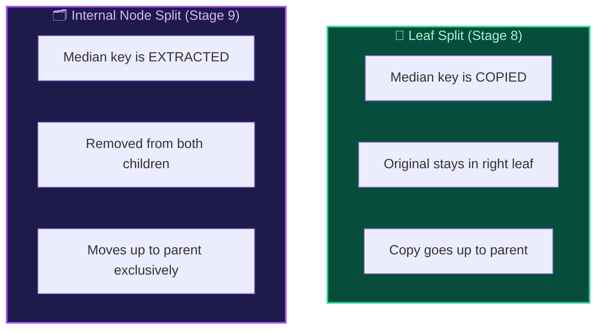
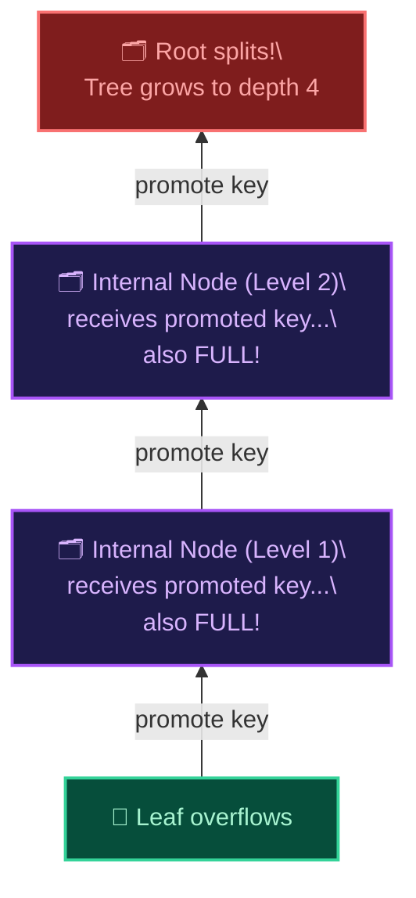

## Beyond Two Levels: Breaking the Internal Node Limit

In Stage 8, we implemented leaf node splitting and created our first internal routing nodes. But there was a hidden limitation: the internal node could accumulate an unlimited number of separator keys without ever splitting itself. For small datasets (under ~100 rows), this works fine — a single internal node can hold enough routing keys. But as the dataset grows, the internal node eventually runs out of space in its 4KB page.

In production databases, a B+Tree must grow to arbitrary depth to handle millions of rows. This stage implements the missing piece: **recursive internal node splitting**.

## The Internal Node Capacity Problem

Each internal node cell consumes 8 bytes (4-byte child pointer + 4-byte separator key). With a 4KB page and a 10-byte header, the maximum number of keys in a single internal node is:

```
INTERNAL_NODE_MAX_KEYS = (4096 - 10) / 8 = 510 keys
```

With 510 keys, a single internal node can point to 511 child leaf pages. Each leaf holds up to 8 rows, giving us a theoretical maximum of **4,088 rows** in a depth-2 tree. Beyond that, we need depth 3, 4, and deeper.

## How Internal Node Split Differs from Leaf Split

The critical difference between splitting a leaf and splitting an internal node is how the **median key** is handled:



In a **leaf split**, the median key remains in the right leaf (because leaf cells hold actual row data that must be preserved) and a copy is promoted to the parent.

In an **internal split**, the median key is **extracted** from the node — it moves exclusively into the parent. Internal nodes only hold routing keys, not row data, so no duplication is necessary.

## Recursive Propagation: Splits All the Way Up

When an internal node splits and promotes a key to its parent, the parent might also be full! This triggers a **recursive cascade** of splits upward through the tree:



This recursive behavior is what makes the B+Tree self-balancing — the tree grows uniformly from the root upward, guaranteeing that all leaf pages always remain at the same depth.

## Root Internal Node Split

When the root internal node itself overflows, the tree must grow one level deeper. The protocol mirrors the root leaf split from Stage 8:

1. **Allocate** a left internal child page and a right internal child page
2. **Copy** the lower half of keys and child pointers into the left child
3. **Copy** the upper half into the right child
4. **Extract** the median key
5. **Reinitialize** Page 0 as a fresh internal root with a single median key, left child pointer, and right_child pointer

After this operation, the tree depth increases by 1, and every existing leaf page remains untouched at the bottom of the hierarchy.

## Scaling Without Limits

With recursive internal node splitting, our B+Tree can now grow to any depth:

| Tree Depth | Max Internal Keys | Max Leaf Pages | Max Rows (8 per leaf) |
|:---:|:---:|:---:|:---:|
| 2 | 510 | 511 | ~4,088 |
| 3 | 510 × 511 | ~261,000 | ~2,088,000 |
| 4 | 510 × 511² | ~133M | ~1 billion |

With just 4 levels of internal nodes, our B+Tree can index over **1 billion rows** while maintaining O(log n) lookup performance. This is exactly how production databases like PostgreSQL and SQLite handle massive datasets with B+Tree indexes!
