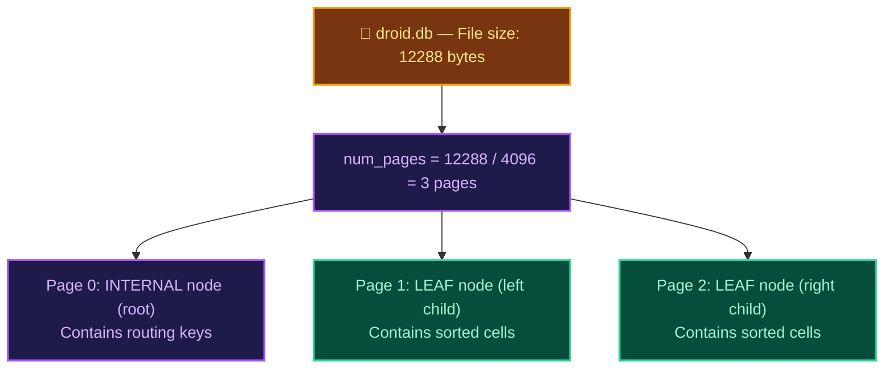
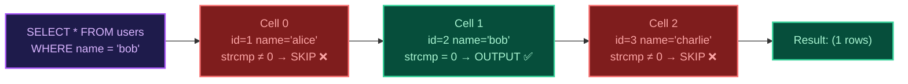

## From Volatile Memory to Durable Storage

Up to Stage 8, our database engine has been a purely in-memory affair. Every INSERT, every carefully balanced B+Tree split, every meticulously sorted leaf node — all of it vanishes the instant the user types `.exit`. In production databases, this would be catastrophic. Users expect their data to survive power failures, program restarts, and system reboots.

In this stage, we bridge the gap between volatile RAM and durable disk storage by implementing a complete **persistence layer**. The core insight is elegantly simple: since our Pager already manages data in uniform 4KB pages, writing those pages to a file is a straightforward block copy operation.

```mermaid
flowchart LR
    subgraph Session1["📝 Session 1 (Write)"]
        I1["INSERT id=1 'alice'"]
        I2["INSERT id=2 'bob'"]
        EXIT[".exit"]
        FLUSH["db_close() flushes\nall pages to disk"]
        I1 --> I2 --> EXIT --> FLUSH
    end

    subgraph DiskFile["💾 droid.db"]
        P0["Page 0: 4KB"]
        P1["Page 1: 4KB"]
        P2["Page 2: 4KB"]
    end

    subgraph Session2["📖 Session 2 (Read)"]
        SEL["SELECT * FROM users;"]
        R1["→ id=1 alice"]
        R2["→ id=2 bob"]
        ROWS["(2 rows)"]
        SEL --> R1 --> R2 --> ROWS
    end

    FLUSH --> DiskFile
    DiskFile --> SEL

    style Session1 fill:#1e1b4b,stroke:#a855f7,stroke-width:2px,color:#d8b4fe
    style Session2 fill:#064e3b,stroke:#34d399,stroke-width:2px,color:#a7f3d0
    style DiskFile fill:#78350f,stroke:#f59e0b,stroke-width:2px,color:#fde68a
```



## The db_close() Flush Protocol

When the user exits the REPL, `db_close()` must guarantee that every modified page in the Buffer Pool is written to the database file before the process terminates. This is the fundamental durability contract:

1. **Iterate** through every page slot in the cache array
2. **Write** each non-null page to its correct file offset: `page_num × PAGE_SIZE`
3. **Close** the file descriptor and free memory

The write offset calculation is critical: Page 0 starts at byte 0, Page 1 at byte 4096, Page 2 at byte 8192, and so forth. Since every page is exactly 4096 bytes, the file becomes a perfectly aligned sequence of raw page images.

## Reconstructing the B+Tree from Disk

When `db_open()` encounters an existing database file, it must reconstruct the Pager state without scanning individual rows:



The beauty of our page-based architecture is that the entire B+Tree structure — node types, cell arrays, routing keys, sibling pointers — is encoded directly in the raw page bytes. No separate index file or reconstruction pass is needed!

## The --db Flag: Database File Control

To support automated testing and database isolation, the engine must accept a `--db <path>` CLI flag:

```bash
./c-db                            # uses default "droid.db"
./c-db --db /tmp/mytest.db        # uses specified path
./c-db --db /tmp/test.db -c "select * from users;"
```

This flag enables multi-session persistence tests where Session 1 inserts data and Session 2 verifies it survived, each using the same `--db` path pointing to a temporary file.

## WHERE Clause: Conditional Row Filtering

The WHERE clause transforms our SELECT from a brute-force full table dump into a precision surgical query tool. The evaluation logic differs based on the filtered column:

* **Primary Key Filter** (`WHERE id = N`): Since the id is the B+Tree key, this could theoretically use `btree_find()` for O(log n) lookup. In this stage, we implement the simpler approach of filtering during cursor traversal. Stage 10 will optimize this with the Query Planner.

* **Non-Key Filter** (`WHERE name = 'alice'`): There is no index on the `name` column, so the engine must perform a sequential scan through all leaf cells, deserializing each row and comparing the `name` field via `strcmp()`.


