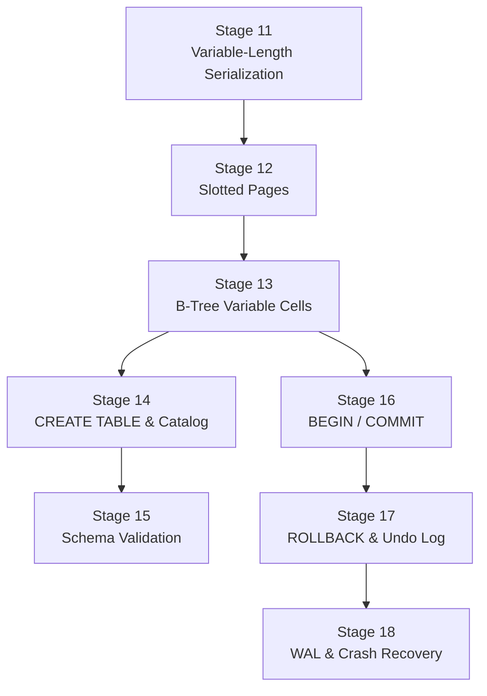

# Part 2: Advanced Database Internals — Stage Design

## Overview

Part 1 (stages 1–10) built a working database with fixed-size rows and a hardcoded schema. Part 2 evolves it into something that resembles a real database engine:

```
Part 2: 8 stages (11–18)
├── Storage Evolution (11–13)
│   ├── 11: Variable-Length Serialization
│   ├── 12: Slotted Page Architecture
│   └── 13: B-Tree Variable Cells
├── Schema & DDL (14–15)
│   ├── 14: CREATE TABLE & Schema Catalog
│   └── 15: Schema Validation from Catalog
└── Transactions (16–18)
    ├── 16: BEGIN / COMMIT
    ├── 17: ROLLBACK & Undo Log
    └── 18: WAL & Crash Recovery
```

### Dependency chain



> [!NOTE]
> Stages 14-15 (schema) and 16-18 (transactions) are independent branches — they both depend on Stage 13 but not on each other. The order shown is a suggestion.

---

## Stage 11: Variable-Length Row Serialization

### What changes
Rows no longer occupy a fixed 508 bytes. Each field stores only the bytes it uses, with a 2-byte length prefix for strings.

### Format comparison

| | Part 1 (fixed) | Part 2 (variable) |
|-|----------------|-------------------|
| Format | `[id:4][name:252][email:252]` | `[row_size:4][id:4][name_len:2][name:N][email_len:2][email:M]` |
| "dan", "d@e" | 508 bytes | 18 bytes |
| "", "" | 508 bytes | 12 bytes |
| 251-char name | 508 bytes | 265 bytes |

### Debug command: `serialize` (updated output)

```
[SERIALIZE] Row Size: 18 bytes (variable)
[SERIALIZE] Layout: [row_size:4@0][id:4@4][name_len:2@8][name:3@10][email_len:2@13][email:3@15]
[SERIALIZE] Field id = 1
[SERIALIZE] Field name = "dan" (3 bytes)
[SERIALIZE] Field email = "d@e" (3 bytes)
[SERIALIZE] Round-trip: OK
```

### Test cases (7)

| # | Case | Key assertions |
|---|------|----------------|
| 1 | `varlen-serialize-short` | Row Size < 508, `(variable)`, Round-trip: OK |
| 2 | `varlen-serialize-exact-size` | name="dan", email="d@e" → `Row Size: 18` |
| 3 | `varlen-serialize-empty` | name="", email="" → `Row Size: 12` |
| 4 | `varlen-serialize-long` | 251-char name → Row Size = 12 + 251 + len(email) |
| 5 | `varlen-serialize-layout` | Layout line shows correct offsets |
| 6 | `varlen-serialize-round-trip` | Deserialize matches serialize for various sizes |
| 7 | `varlen-serialize-error` | Bad SQL → error code |

---

## Stage 12: Slotted Page Architecture

### What changes
Pages switch from fixed-offset cells to a **slotted** layout. A slot directory at the top of the page points to records stored at the bottom.

### Page layout

```
┌────────────────────────────────────────────────────┐
│ Page Header (8 bytes)                              │
│  [type:1][slot_count:2][free_start:2][free_end:2]  │
├────────────────────────────────────────────────────┤
│ Slot 0: [offset:2][length:2]                       │
│ Slot 1: [offset:2][length:2]                       │
│ Slot 2: [offset:2][length:2]                       │
│ ← free_start                                       │
│                                                    │
│              ... free space ...                     │
│                                                    │
│                              free_end →             │
│ Record 2: [key + serialized row]                   │
│ Record 1: [key + serialized row]                   │
│ Record 0: [key + serialized row]                   │
└────────────────────────────────────────────────────┘
```

- **Slots** grow downward from the header
- **Records** grow upward from the page end
- **Free space** = `free_end - free_start`
- Page is full when `free_end - free_start < record_size + 4` (4 = slot size)

### Debug command: `pager dump-page <N>` (new)

```
[PAGER] Page 0: type=LEAF slots=3 free_space=3520
[PAGER]   Slot 0: offset=4078 length=22
[PAGER]   Slot 1: offset=4056 length=22
[PAGER]   Slot 2: offset=4030 length=26
```

### Test cases (6)

| # | Case | Key assertions |
|---|------|----------------|
| 1 | `slotted-page-empty` | `slots=0`, free_space ≈ 4088 |
| 2 | `slotted-page-one-insert` | `slots=1`, slot offset/length present |
| 3 | `slotted-page-multiple` | After 3 INSERTs, `slots=3` |
| 4 | `slotted-page-variable-sizes` | Different row sizes → different slot lengths |
| 5 | `slotted-page-free-space` | Free space decreases with each insert |
| 6 | `slotted-page-records-backward` | Slot offsets decrease (records grow from end) |

---

## Stage 13: B-Tree with Variable-Length Cells

### What changes
B-tree leaf cells are now variable-length. The key change: **split when free space is exhausted, not when cell count exceeds a fixed limit**.

- Leaf cell = `[key:4][serialized_row:variable]`
- Internal cell = `[key:4][child_page:4]` (still fixed — 8 bytes)
- Split trigger: `free_space < min_record_size + slot_size`

### Key insight for the student
With fixed 512-byte cells, a leaf always held ~7 rows. With variable-length cells, a leaf storing short rows (name="a", email="b") might hold **50+ rows**, while a leaf storing long rows might still hold only 7. The B-tree adapts automatically.

### Updated `btree dump` format

```
[BTREE] Page 0: type=LEAF num_cells=12 free_space=1200
[BTREE]   Cell 0: key=1 (22 bytes)
[BTREE]   Cell 1: key=2 (18 bytes)
[BTREE]   Cell 2: key=3 (45 bytes)
```

### Test cases (8)

| # | Case | Key assertions |
|---|------|----------------|
| 1 | `varlen-btree-cell-sizes` | Cell sizes differ when row content differs |
| 2 | `varlen-btree-more-cells` | Small rows → more cells per leaf than Part 1's ~7 |
| 3 | `varlen-btree-find` | `btree find` returns correct variable-length data |
| 4 | `varlen-btree-sorted` | Keys still sorted after out-of-order insertion |
| 5 | `varlen-btree-split-small-rows` | Many small rows before split (20+) |
| 6 | `varlen-btree-split-large-rows` | Few large rows before split (~7) |
| 7 | `varlen-btree-structure` | Tree depth increases on split |
| 8 | `varlen-btree-select-all` | SELECT returns all rows, correct count, correct data |

---

## Stage 14: CREATE TABLE & Schema Catalog

### What changes
Remove the hardcoded "users" table. The student implements `CREATE TABLE` and stores table definitions in a **schema catalog** — a special system table that the database reads on startup.

### New SQL command

```sql
CREATE TABLE users (id INT, name VARCHAR, email VARCHAR);
CREATE TABLE products (id INT, title VARCHAR, price INT);
```

### Schema catalog design

The catalog is stored in **page 0** (or a dedicated system page) as a special B-tree with a known structure:

```
Catalog Row: [table_name:varchar][column_count:int][col1_name:varchar][col1_type:varchar]...
```

On startup, the database reads the catalog to know which tables exist and their schemas.

### Debug command: `catalog list`

```
[CATALOG] Tables:
[CATALOG]   users (id INT, name VARCHAR, email VARCHAR)
[CATALOG]   products (id INT, title VARCHAR, price INT)
```

### Test cases (8)

| # | Case | Key assertions |
|---|------|----------------|
| 1 | `create-table-basic` | `CREATE TABLE users (...)` succeeds, no error |
| 2 | `create-table-catalog-list` | `catalog list` shows the created table |
| 3 | `create-table-multiple` | Create 2 tables, both appear in catalog |
| 4 | `create-table-duplicate-error` | Creating same table twice → error |
| 5 | `create-table-persistence` | Create table, restart (--db), `catalog list` still shows it |
| 6 | `insert-after-create` | `CREATE TABLE` then `INSERT` works |
| 7 | `select-after-create-insert` | Full cycle: CREATE → INSERT → SELECT returns data |
| 8 | `create-table-syntax-error` | Bad CREATE TABLE syntax → error |

---

## Stage 15: Schema Validation from Catalog

### What changes
INSERT and SELECT now validate against the catalog instead of a hardcoded schema. This catches:
- INSERT into a table that doesn't exist
- INSERT with wrong number of columns
- INSERT with wrong column names
- INSERT with type mismatch (string where INT expected)

### Test cases (7)

| # | Case | Key assertions |
|---|------|----------------|
| 1 | `validate-table-not-exists` | `INSERT INTO unknown ...` → error (table not found) |
| 2 | `validate-wrong-column-count` | INSERT with 2 values into 3-column table → error |
| 3 | `validate-wrong-column-name` | INSERT with unknown column name → error |
| 4 | `validate-type-mismatch` | INSERT string into INT column → error |
| 5 | `validate-select-unknown-table` | `SELECT * FROM unknown` → error |
| 6 | `validate-where-unknown-column` | `WHERE unknown_col = 1` → error |
| 7 | `validate-correct-insert` | Correct INSERT into cataloged table → no error |

---

## Stage 16: Transactions — BEGIN / COMMIT

### What the student learns
Until now, every INSERT immediately modified the B-tree and (on `.exit`) flushed to disk. With transactions, the student learns **atomicity**: a group of operations either all succeed (COMMIT) or none of them take effect.

### New SQL commands

```sql
BEGIN;
INSERT INTO users (id, name, email) VALUES (1, 'alice', 'alice@test.com');
INSERT INTO users (id, name, email) VALUES (2, 'bob', 'bob@test.com');
COMMIT;
```

### Behavior rules

| Scenario | What happens |
|----------|-------------|
| No `BEGIN` (auto-commit) | Each statement commits immediately (current behavior) |
| `BEGIN` then `COMMIT` | All changes between BEGIN and COMMIT become permanent |
| `BEGIN` then `.exit` (no COMMIT) | Changes are **lost** (not committed) |
| `BEGIN` then `BEGIN` | Error: already in a transaction |
| `COMMIT` without `BEGIN` | Error: no active transaction |

### Implementation hint
The simplest approach: on BEGIN, mark the transaction as active. On COMMIT, flush dirty pages to disk. On `.exit` without COMMIT, skip the flush (changes in memory are lost).

### Test cases (7)

| # | Case | Key assertions |
|---|------|----------------|
| 1 | `tx-auto-commit` | INSERT without BEGIN → data persists across sessions |
| 2 | `tx-begin-commit` | BEGIN → INSERT → COMMIT → data persists |
| 3 | `tx-begin-no-commit` | BEGIN → INSERT → .exit (no COMMIT) → data LOST |
| 4 | `tx-multiple-inserts` | BEGIN → 3 INSERTs → COMMIT → all 3 persist |
| 5 | `tx-nested-begin-error` | BEGIN → BEGIN → error |
| 6 | `tx-commit-no-begin-error` | COMMIT without BEGIN → error |
| 7 | `tx-select-in-transaction` | BEGIN → INSERT → SELECT (within same tx) → sees new data |

---

## Stage 17: Transactions — ROLLBACK & Undo Log

### What the student learns
COMMIT makes changes permanent. **ROLLBACK** undoes them. To support ROLLBACK, the database must record "before images" — what pages looked like before the transaction modified them.

### New SQL command

```sql
BEGIN;
INSERT INTO users (id, name, email) VALUES (1, 'alice', 'alice@test.com');
ROLLBACK;
-- alice is NOT in the database
```

### Undo log design

When a transaction modifies a page:
1. **Before writing**: copy the original page to an in-memory undo buffer
2. **On COMMIT**: discard the undo buffer (changes are final)
3. **On ROLLBACK**: restore pages from the undo buffer

```
Undo Log Entry: [page_number:4][original_page_data:4096]
```

This is the simplest approach — a full page copy. Real databases use more granular logging (row-level undo), but full-page copies teach the concept clearly.

### Test cases (7)

| # | Case | Key assertions |
|---|------|----------------|
| 1 | `tx-rollback-basic` | BEGIN → INSERT → ROLLBACK → data NOT present |
| 2 | `tx-rollback-multiple` | BEGIN → 3 INSERTs → ROLLBACK → none present |
| 3 | `tx-rollback-then-commit` | ROLLBACK → BEGIN → INSERT → COMMIT → data persists |
| 4 | `tx-rollback-no-begin-error` | ROLLBACK without BEGIN → error |
| 5 | `tx-committed-data-survives` | BEGIN → INSERT → COMMIT → new BEGIN → ROLLBACK → first data still there |
| 6 | `tx-rollback-select-empty` | BEGIN → INSERT → ROLLBACK → SELECT → (0 rows) |
| 7 | `tx-undo-page-restore` | INSERT in tx, ROLLBACK, verify btree dump shows empty node |

---

## Stage 18: WAL & Crash Recovery

### What the student learns
COMMIT guarantees durability — but what if the process crashes DURING a commit (half the pages flushed, half not)? The **Write-Ahead Log (WAL)** solves this: write the changes to a sequential log file BEFORE modifying pages. On crash, replay the WAL.

### WAL protocol

```
1. BEGIN
2. Make changes in memory (dirty pages)
3. COMMIT:
   a. Write all dirty page changes to WAL file (sequential write)
   b. Write COMMIT record to WAL
   c. fsync WAL file (guaranteed on disk)
   d. Now apply changes to actual data pages
   e. When all pages flushed: CHECKPOINT (truncate WAL)
```

The key guarantee: **WAL is written and synced BEFORE data pages**. If crash happens:
- After step (c): replay WAL on restart → data recovered ✅
- Before step (c): WAL incomplete → transaction rolled back ✅

### WAL file format

```
WAL Header: [magic:4][version:4]
WAL Record: [tx_id:4][type:1][page_num:4][page_data:4096]
COMMIT Record: [tx_id:4][type:1=COMMIT]
```

### Debug command: `wal status`

```
[WAL] File: droid.wal (12288 bytes)
[WAL] Records: 3
[WAL]   Record 0: tx=1 type=PAGE page=0 (4096 bytes)
[WAL]   Record 1: tx=1 type=PAGE page=1 (4096 bytes)
[WAL]   Record 2: tx=1 type=COMMIT
[WAL] Last checkpoint: record 0
```

### Test cases (7)

| # | Case | Key assertions |
|---|------|----------------|
| 1 | `wal-commit-persists` | BEGIN → INSERT → COMMIT → restart → data present |
| 2 | `wal-no-commit-lost` | BEGIN → INSERT → kill process → restart → data NOT present |
| 3 | `wal-file-exists` | After COMMIT, `.wal` file exists |
| 4 | `wal-status` | `wal status` shows records and commit entries |
| 5 | `wal-checkpoint` | After checkpoint, WAL is truncated |
| 6 | `wal-crash-recovery` | Simulate crash after WAL write but before page flush → data recovered |
| 7 | `wal-multiple-transactions` | Multiple tx committed, restart, all data present |

---

## Full Tutorial Pipeline (Parts 1 + 2)

```
Part 1: Fixed-Layout Database (Foundation)
 1. REPL ✅                     6. B-Tree Leaf & INSERT
 2. Lexer ✅                    7. B-Tree Search & SELECT
 3. Parser ✅                   8. B-Tree Splits
 4. Row Serialization (fixed)   9. Persistence & WHERE
 5. Pager & Buffer Pool        10. Query Planner (Volcano)

Part 2: Advanced Database Internals
11. Variable-Length Serialization   15. Schema Validation
12. Slotted Page Architecture       16. BEGIN / COMMIT
13. B-Tree Variable Cells            17. ROLLBACK & Undo Log
14. CREATE TABLE & Catalog           18. WAL & Crash Recovery
```

**Total: 18 stages, ~100 test cases**

### Test case count per stage

| Stage | Tests | Topic |
|-------|-------|-------|
| 11 | 7 | Variable-length serialization |
| 12 | 6 | Slotted pages |
| 13 | 8 | Variable B-tree |
| 14 | 8 | CREATE TABLE & catalog |
| 15 | 7 | Schema validation |
| 16 | 7 | BEGIN / COMMIT |
| 17 | 7 | ROLLBACK & undo |
| 18 | 7 | WAL & crash recovery |
| **Total** | **57** | |

### Breaking changes summary

| When you implement... | These Part 1 tests break... | Why |
|-----------------------|----------------------------|-----|
| Stage 11 | Stage 4 (serialize) | Row Size no longer 508 |
| Stage 12 | Stage 5 (pager) | Page format changed to slotted |
| Stage 13 | Stages 6-8 (btree) | Cell format changed, split logic changed |
| Stage 14 | Stages 6-9 (insert/select) | Must CREATE TABLE before INSERT |
| Stage 15 | Stage 3 (parser error tests) | New validation errors from catalog |

> [!TIP]
> Each Part 2 stage has its own test suite. Run `make test-c-stage11` etc. You don't need Part 1 tests to pass anymore once you start Part 2.
